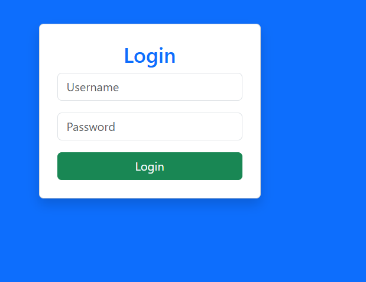
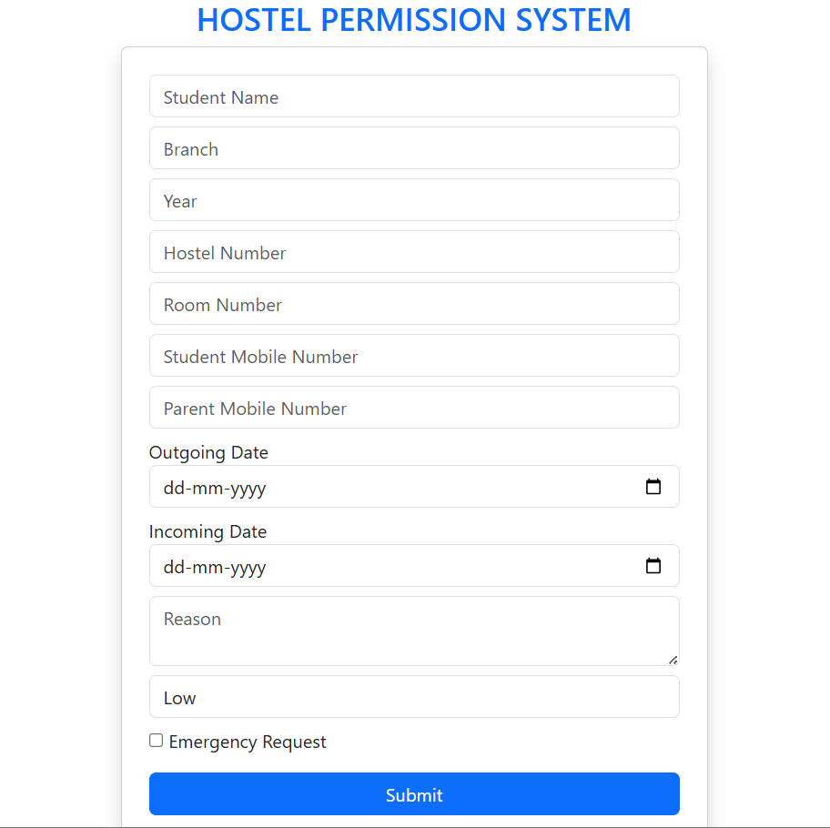
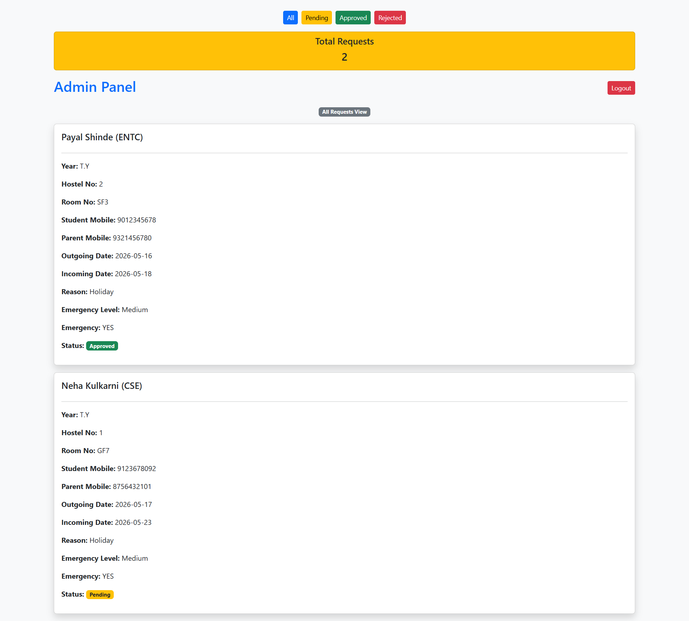
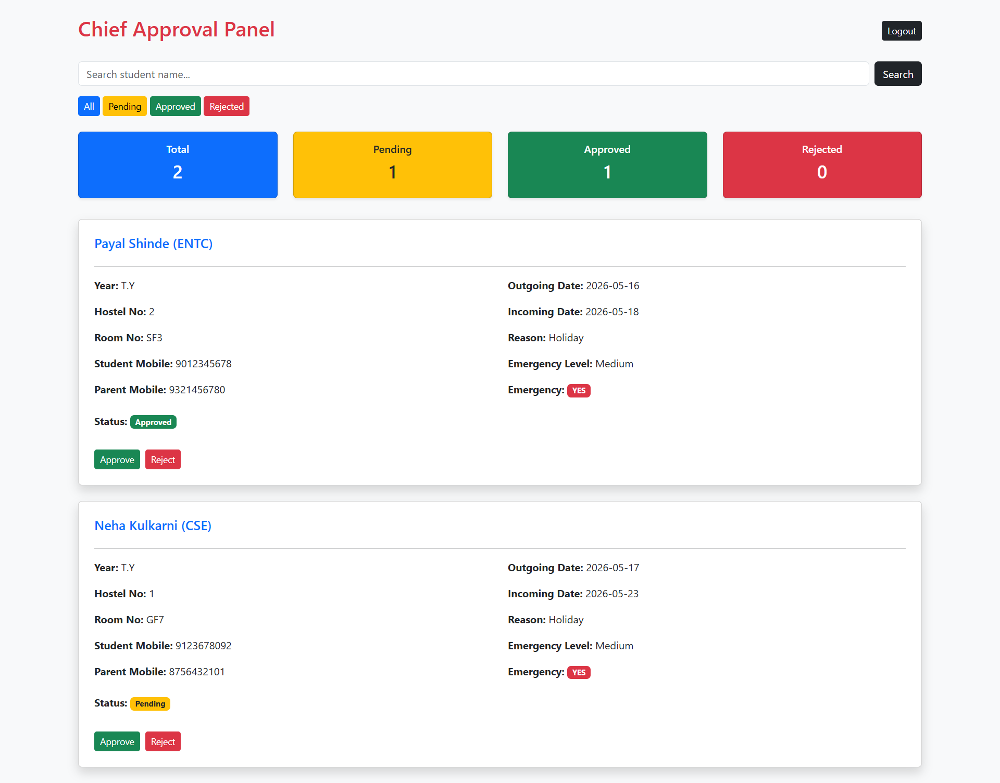

# 🏨 Hostel Permission Management System

A web-based Hostel Permission Management System developed using Flask and SQLite to digitize the hostel leave approval process.

The system allows students to submit leave requests online, while Admin and Chief Rector can manage, approve, reject, search, and monitor requests efficiently through dedicated dashboards.


# 🚀 Features

- Student Leave Request Form
- Admin Login System
- Chief Rector Login System
- Secure Session Management
- Approve / Reject Requests
- Dashboard with Counters
- Search Student Requests
- Filter by Status
- Print Permission Support
- SQLite Database Integration
- Responsive Bootstrap UI
- Duplicate Request Prevention.


#  Technologies Used

- Python
- Flask
- SQLite
- HTML5
- CSS3
- Bootstrap 5


#  Modules

##  Student Module
- Submit hostel leave requests
- Enter personal and emergency details

##  Admin Module
- View all submitted requests
- Monitor request status
- Dashboard analytics

##  Chief Rector Module
- Approve / Reject requests
- Search student records
- Filter requests by status
- Print permission details

---

# 📂 Project Structure

```bash
HOSTELPERMISSION/
│
├── app.py
├── hostel.db
│
├── templates/
│   ├── index.html
│   ├── login.html
│   ├── admin.html
│   └── chief.html
│
├── static/
│   └── style.css
```


# ▶️ How to Run

## 1️⃣ Clone Repository

```bash
git clone https://github.com/sakshi2025-arch/hostel-permission-system.git
```

## 2️⃣ Open Project Folder

```bash
cd hostel-permission-system
```

## 3️⃣ Install Flask

```bash
pip install flask
```

## 4️⃣ Run Application

```bash
python app.py
```

## 5️⃣ Open Browser

```bash
http://127.0.0.1:5000
```


# 🔐 Login Credentials

## Admin Login

```text
Username: admin
Password: admin123
```

## Chief Rector Login

```text
Username: chief
Password: chief123
```


# 📌 Future Enhancements

- Email Notification System
- OTP Verification
- QR-Based Permission Approval
- Cloud Database Integration
- Mobile Application Support


# 💡 Project Objective

The main objective of this project is to reduce manual paperwork and simplify the hostel leave approval process using a digital management system.


# Screenshots

## Login Page


## Application Form


## Admin Panel


## Chief Panel



# ✅ Final Output

The system successfully manages hostel leave requests digitally with role-based access for Admin and Chief Rector using Flask and SQLite.


# 👩‍💻 Developed By

Sakshi Shivaji Chaugule
Computer Science Student
